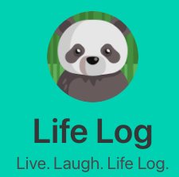
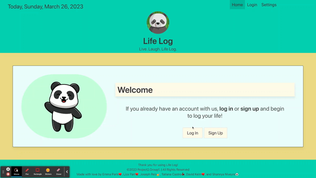
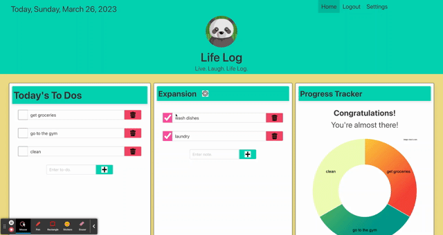

# Project-2

## Description

LifeLog was created to practice combining the skills covered thus far in boot camp to create a practical and convenient way to schedule your life. The motivation behind this project was simple: create an app that can do everything that existing schedule apps can't do already. We wanted to build something that would eliminate the need for multiple schedule tracking and note-taking apps. LifeLog allows users to create To Do lists within to do lists, view a calendar, and see how much of their day is taken up by each to do item all in one place. 

Our team continued learning throughout the building of LifeLog. An important lesson we learned was the importance of understanding what the MVP functionalities and appearance includes, so as to all be on the same page. We also found that communication was of greater significance than we initially anticipated: Git pulls and merging PRs can sometimes depend on clear communication. 

## Table of Contents (Optional)

If your README is long, add a table of contents to make it easy for users to find what they need.

- [Installation](#installation)
- [Usage](#usage)
- [Credits](#credits)
- [License](#license)

## Installation

What are the steps required to install your project? Provide a step-by-step description of how to get the development environment running.

If you use LifeLog via Heroku, there is no installation required. 

If you download files from the GitHub repository, you will have to run "npm i" in your terminal and log into MySQL to run "source schema.sql." Once you've run schema and quit MySQL, you need to seed the data by running the command "node seeds/seed.js" which will allow you to begin using LifeLog. 

Happy logging!

## Usage

To use LifeLog, login with your username and password or create an account if you don't already have one.

When you are logged in, you will be directed to the homepage. In the leftmost section, you can enter new to-do items by typing in your item and pressing the + key to add it to the list. Check off items as they are completed! Remove them by clicking the trash can icon.

You can click on items in "Today's To Dos" which will allow you to make a sub-list in the "Expansion" section.

When you create to-do items, you can select how often you want them to populate your LifeLog by selecting the  in the "Expansion" section.

On the right, you will see how much of your day each to do item takes up. 

## Credits

Contributors to LifeLog include:
* [Emma Paris](https://github.com/emmaparis)
* [David Keim](https://github.com/keimdm)
* [Tatiana Castro](https://github.com/tatys5394)
* [Shannya Niveyro](https://github.com/ShannyaN)
* [Liza Parr](https://github.com/lparr30)
* [Joseph Reis](https://github.com/JosephReis646)

LifeLog also makes use of [Image Charts](https://documentation.image-charts.com/), an API that allowed us to implement a pie chart into our app. [FullCalendar](https://fullcalendar.io/docs) is a library we used to have a calendar appear on the homepage. Lastly, [Day.js](https://day.js.org/) enabled us to keep the current day displayed on the homepage. 

